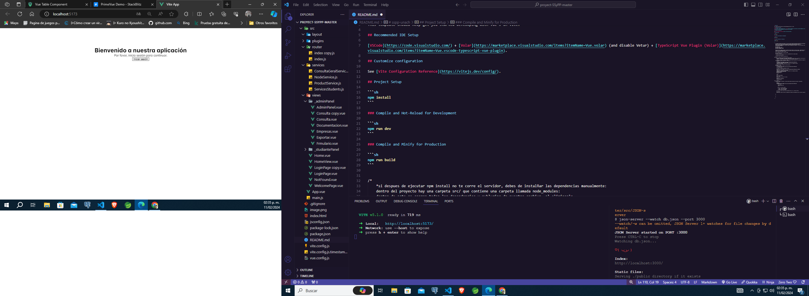

# sspp-unach

This template should help get you started developing with Vue 3 in Vite.

## Recommended IDE Setup

[VSCode](https://code.visualstudio.com/) + [Volar](https://marketplace.visualstudio.com/items?itemName=Vue.volar) (and disable Vetur) + [TypeScript Vue Plugin (Volar)](https://marketplace.visualstudio.com/items?itemName=Vue.vscode-typescript-vue-plugin).

## Customize configuration

See [Vite Configuration Reference](https://vitejs.dev/config/).

## Project Setup

```sh
npm install
```

### Compile and Hot-Reload for Development

```sh
npm run dev
```

### Compile and Minify for Production

```sh
npm run build
```


/*
    *si despues de ejecutar npm install no te corre el servidor, debes de instalñar las dependencias manualmente:
    dentro del proyecto hay una carpeta src/ que contiene una carpeta llamada node_modules:
    dentro de este se cargan todas las dependencias y publugins de nuestro archivo. al eliminarla,
    haremos que el pakacgeJson.json se ejecute creando las dependencias nuevamente, si eso no te funciono, aqui te dejo
    de lo que debes de instalr:

    npm install sass
    npm install axios --save
    npm install primevue@3 --save
    npm install primeicons --save
    

    Ahora para poner a prueba y levantas un servidor Json para simular un servcio de login , tenemos dentro de la 
    carpeta src una llamada JSON-server. dentor de ela tiene el db.json que contine datos de login, es decir 
    datos de usuario para simular el login . 

    para elo debemos de instalr el server de JSON

    npm install json-server
    en todo caso  deje un archivo de texto con el comando dentro de la misma carpeta 

    . ok Ahora que todo esta bien.

    lanzaremos nuestro systema en modo desarrollo:

paso 1.-:
     abrimos 2 terminales con la misma ruta de nuestro proyecto:
        la terminal nos dirigimos a la carpeta src/Json-server/ y dentro de ella , levantamos el server-json con el 
        comando :   json-server --watch archivo.json(en mi caso db.json) --port 3000
        
        el puerto del server arrancara ene l 3000, si ocupas ese puerto cambiar por uno diferente por ejemplo 3005
    Sino lo haces como indico te arrojara el sig error: 
        example:

        jose_@DESKTOP-VT3J75H MINGW64 /e/User_jose_/Descargas/proyect-SSyPP-master
        $ json-server --watch db.json --port 3000
        --watch/-w can be omitted, JSON Server 1+ watches for file changes by default
        File db.json not found
    
    si seguiste mis pasos , te debio salir algo como esto: 
    nos movemos a la ruta:

        jose_@DESKTOP-VT3J75H MINGW64 /e/User_jose_/Descargas/proyect-SSyPP-master
        $ cd src/JSON-server/

        ejecutamos el comando par alevantar el server:

        jose_@DESKTOP-VT3J75H MINGW64 /e/User_jose_/Descargas/proyect-SSyPP-master/src/JSON-s
        erver
        $ json-server --watch db.json --port 3000
        --watch/-w can be omitted, JSON Server 1+ watches for file changes by default
        JSON Server started on PORT :3000
        Press CTRL-C to stop
        Watching db.json...

        ♡( ◡‿◡ )

        Index:
        http://localhost:3000/

        Static files:
        Serving ./public directory if it exists

        Endpoints:
        http://localhost:3000/users

        ok Todo salio bien, 
         ahora el 
paso 2.-:
    en lamotra rerminal nos movemos a la direcion donde tenemos alojado nuetro proyecto y ehjecutamos :
        npm run dev

        ejemplo:
        jose_@DESKTOP-VT3J75H MINGW64 /e/User_jose_/Descargas/proyect-SSyPP-master
            $ npm run dev

            > sspp-unach@0.0.0 dev
            > vite


            VITE v5.1.0  ready in 4970 ms

            ➜  Local:   http://localhost:5173/
            ➜  Network: use --host to expose
            ➜  press h + enter to show help

        en mi caso es run dev, pero en otras versiones de vue o cli , son npm run server.

                 ---> Visualizxar con ctrl+click;


        Eso es Todo .
        REcuerda que el login ya tiene las credenciales por defecto solo queda darle Click  para entrar copom Admin

        
    * 
    *
    *

    *
    *
    *

 */